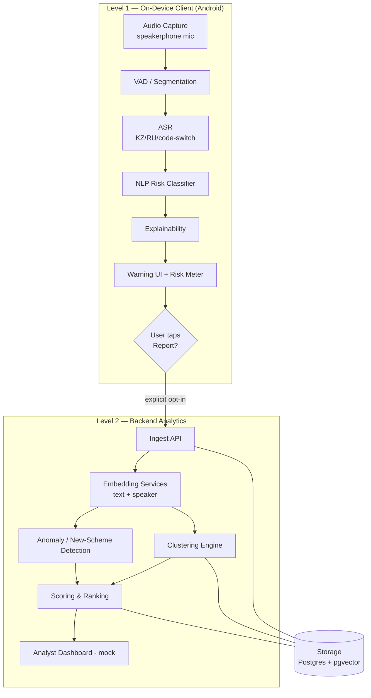
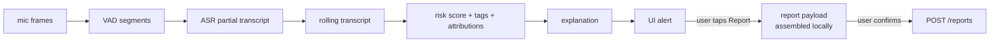
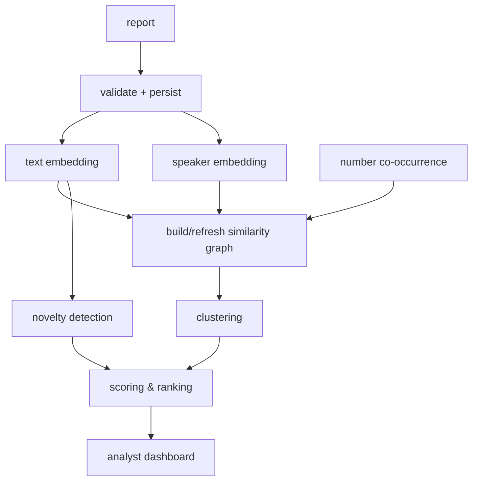
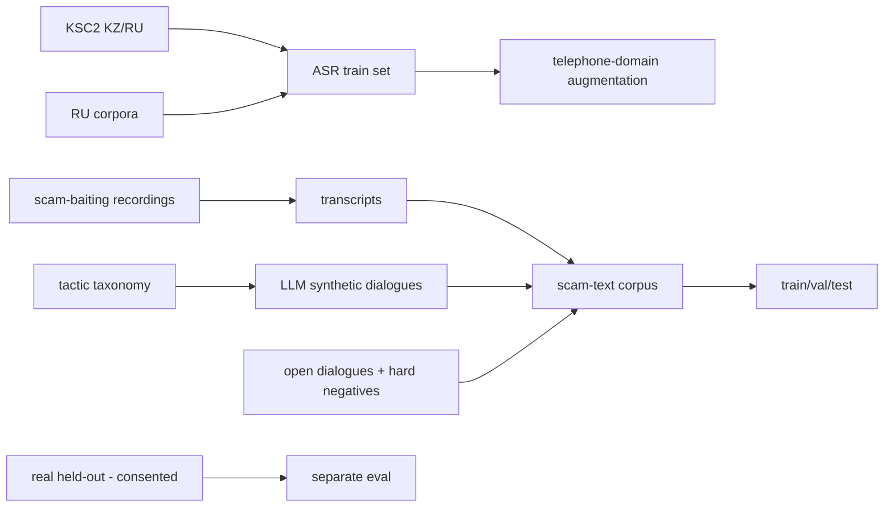
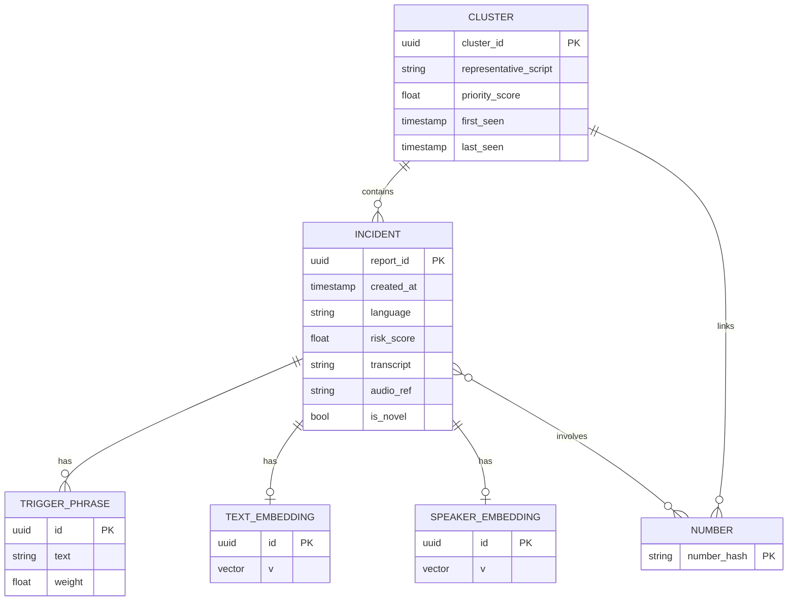

# Qorğan — Technical Documentation

*Engineering documentation for future development. This document intentionally excludes problem-domain statistics and pitch material (those live in the presentation deck). It describes the system to be built, its components, interfaces, data pipeline, models, constraints, and roadmap.*

**Status:** design / pre-MVP · **Target platform:** Android-first · **License of key datasets:** see [References](#18-references).

---

## Table of Contents

1. [Purpose & Scope](#1-purpose--scope)
2. [Locked Design Decisions](#2-locked-design-decisions)
3. [System Overview](#3-system-overview)
4. [Level 1 — On-Device Client](#4-level-1--on-device-client)
5. [Level 2 — Backend Analytics](#5-level-2--backend-analytics)
6. [Data Pipeline](#6-data-pipeline)
7. [ML Training & Evaluation](#7-ml-training--evaluation)
8. [API Contracts & Schemas](#8-api-contracts--schemas)
9. [Data Model](#9-data-model)
10. [Explainability](#10-explainability)
11. [Privacy, Security & Legal Constraints](#11-privacy-security--legal-constraints)
12. [Technical Constraints & Known Limitations](#12-technical-constraints--known-limitations)
13. [Tech Stack](#13-tech-stack)
14. [Repository Structure](#14-repository-structure)
15. [Development Environment & Run Instructions](#15-development-environment--run-instructions)
16. [Testing Strategy](#16-testing-strategy)
17. [Roadmap & Open Decisions](#17-roadmap--open-decisions)
18. [References](#18-references)
19. [Glossary](#19-glossary)

---

## 1. Purpose & Scope

Qorğan is a two-level system that detects social-engineering (scam) patterns in phone conversations and turns confirmed reports into structured intelligence about organized scam networks.

**Functional goal (Level 1):** during a call on speakerphone, transcribe Kazakh/Russian/code-switched speech, score the conversation for scam risk in near-real-time, and warn the user with a concrete, explainable reason before any money is transferred.

**Functional goal (Level 2):** aggregate voluntarily submitted reports and cluster them into scam "organizations" by script similarity, voice similarity, and number relationships; rank clusters; and surface previously unseen scripts (new schemes) to an analyst.

**Non-goals (explicitly out of scope):**
- Synthetic-voice / deepfake-voice detection (the core AI is scam **content** detection, not voice authenticity).
- Speaker identification of individuals (voice embeddings are used only to *link* incidents, anonymized).
- Automatic decision-making or automatic reporting (the system never hangs up or sends anything on its own).
- Interception of call audio at the OS/telephony layer (not possible for a third-party app; see [§12](#12-technical-constraints--known-limitations)).

---

## 2. Locked Design Decisions

These are settled for MVP and should not be relitigated mid-build:

1. **Core AI = NLP scam-content classification** over the transcript. Not deepfake/voice-authenticity.
2. **Voice embeddings = a Level-2 clustering feature only**, anonymized (vector, not identity).
3. **On-device real-time is a target, not a claim.** Prototype captures via speakerphone microphone, processes in short segments, and reports measured latency honestly.
4. **Level 2 (government analytics) is the primary value.** Level 1 is the data source for it.
5. **Depth over breadth in ML:** ship 1–2 components with real metrics rather than five shallow ones.
6. **False positive rate (FPR) is the primary product metric**, not recall.

---

## 3. System Overview



**Two deployable subsystems:**
- **Level 1** — an Android app. All inference runs locally; nothing leaves the device without an explicit user action.
- **Level 2** — a backend service (ingest + analytics) with an analyst dashboard. In the prototype the dashboard is a mock (no real government API to integrate with yet).

The only data crossing from L1 to L2 is a **report**, and only after explicit user consent.

---

## 4. Level 1 — On-Device Client

### 4.1 Audio Capture
- Android **foreground `Service`** holding `RECORD_AUDIO`. Captures microphone audio while the call is on speakerphone.
- A third-party app **cannot** tap the telephony audio stream directly; speakerphone capture is the only viable prototype path.
- Capture PCM **16 kHz mono**. Note real telephone audio is narrowband (~8 kHz); the pipeline must tolerate the acoustic mismatch (see data augmentation, [§6](#6-data-pipeline)).
- Ring buffer with fixed-size frames (e.g., 20 ms), aggregated for VAD.

### 4.2 VAD / Segmentation
- Voice-activity detection (Silero VAD or WebRTC VAD) to isolate speech.
- Emit **sliding-window segments** (e.g., 5–8 s with 1–2 s overlap) to the ASR queue, so scoring updates during the call rather than after it.

### 4.3 ASR Module
- **Input:** PCM 16 kHz mono segment. **Output:** partial transcript + token/word timestamps + per-segment language tag.
- **Model:** an ASR model fine-tuned for Kazakh/Russian and code-switching. Candidate bases: `faster-whisper` (CTranslate2), `whisper.cpp` (GGML, quantized), NVIDIA NeMo streaming, or Vosk. Fine-tune on KSC2 + Russian corpora with telephone-domain adaptation.
- **On-device runtime (decision open):** `whisper.cpp` / ONNX Runtime Mobile / TFLite. Quantization (INT8 / GGML Q5–Q8) is mandatory for phone-class CPUs.
- **Streaming strategy:** true streaming Whisper on Android CPU is impractical (see [§12](#12-technical-constraints--known-limitations)). Use a pseudo-streaming policy (LocalAgreement-2 with context carry-over) or chunked processing on short segments for MVP.
- Token timestamps are required so explainability highlights can map back to audio.

### 4.4 NLP Risk Classifier
- **Input:** rolling accumulated transcript of the conversation so far.
- **Output:** `risk_score ∈ [0,1]` + multi-label **tactic tags** (e.g., `impersonation_bank`, `urgency`, `secrecy`, `otp_request`, `safe_account`, `payment_redirect`, `dropper_recruitment`).
- **Model:** fine-tuned multilingual transformer (XLM-R base or a distilled variant) for sequence classification + multi-label head. Quantized (INT8) ONNX/TFLite for on-device inference.
- **Thresholding:** conservative, tuned for low FPR; apply hysteresis to prevent alert flicker as the transcript grows.
- **Feature attribution:** integrated gradients / attention rollout / token-level SHAP → token spans, consumed by the explainability module.

### 4.5 Explainability Module
- Consumes classifier output + attributions and produces:
  - highlighted **trigger phrases** (mapped to transcript spans),
  - contributing **tactic tags**,
  - **confidence**,
  - a localized (RU/KZ) human-readable reason **grounded in the attributed spans** (templated, not free-form LLM generation).
- See [§10](#10-explainability).

### 4.6 Warning UI
- Live risk meter that rises through the call; alert overlay with reasons; haptic feedback; **"Report scammer"** button.
- Localization: RU and KZ.

### 4.7 Consent & Report Flow
- All processing is local. A report is assembled **only when the user taps "Report."**
- The user reviews the report contents (number, transcript, trigger phrases, risk score, optional audio) on a consent screen before it is sent. **No auto-send under any condition.**

### 4.8 Level 1 Data Flow



---

## 5. Level 2 — Backend Analytics

### 5.1 Ingest API
- Accepts reports (schema in [§8.1](#81-report-object)). Validates, authenticates, persists, and enqueues for embedding.

### 5.2 Embedding Services
- **Text embedding:** multilingual sentence embedding (e.g., LaBSE or `multilingual-e5`) over the transcript → used for script similarity.
- **Speaker embedding:** ECAPA-TDNN / `pyannote` / SpeechBrain over the report audio → anonymized voice vector for linking incidents by voice. **No raw identity stored; vector only.**

### 5.3 Clustering Engine
- Groups incidents into "organizations" using three combined signals:
  1. transcript-embedding similarity (same/similar script),
  2. speaker-embedding similarity (same voice across numbers),
  3. phone-number co-occurrence graph.
- **Algorithm (decision open):** HDBSCAN over the combined feature space, **or** community detection (Louvain) on a similarity graph whose edge weights combine the three signals.
- **Output:** clusters with member incidents, a representative script, and the set of linked numbers/voices.

### 5.4 Anomaly / New-Scheme Detection
- Novelty detection on transcript embeddings (isolation forest, distance-to-nearest-cluster, or embedding-density estimate) to flag scripts that don't fit any known cluster → early signal of a new scheme.

### 5.5 Scoring & Ranking
- Rank clusters by activity (incident count, recency, growth rate) and estimated impact, producing a prioritized queue for the analyst.

### 5.6 Analyst Dashboard (Mock)
- Cluster map, drill-down to incidents, filters, priority queue. Reads from the backend.
- **Mock** because there is no real government intake API yet; a real integration is a main-program deliverable.

### 5.7 Level 2 Pipeline



---

## 6. Data Pipeline

> Datasets and generation methodology below are engineering inputs, not presentation statistics.

### 6.1 Corpora
- **ASR base — KSC2** (ISSAI): Kazakh with Kazakh-Russian code-switching. Domain is broadcast/parliament/podcast, **not** telephone or scam speech — treat as a base for Kazakh recognition that requires telephone-domain adaptation.
- **Russian ASR corpora:** open Russian speech data to strengthen the RU tract.
- **Scam-text corpus (methodology after TeleAntiFraud-28k):**
  - transcriptions of publicly available scam-baiting call recordings (mostly RU) → real anchor;
  - LLM-generated dialogues from a documented scam-tactic taxonomy (RU + KZ);
  - TTS-synthesized audio for audio-side tests.
- **Negatives:** ordinary conversations from open dialogue corpora **plus hard negatives** (a genuine bank call; a relative asking for a transfer) — critical for low FPR.
- **Real held-out set:** a small set of real recordings collected by the team **with consent**, kept entirely separate and evaluated on its own (this is the honest generalization check).

### 6.2 Preprocessing
- Telephone-domain augmentation for ASR: downsample to 8 kHz, apply codec/noise augmentation, re-upsample.
- Text normalization, PII scrubbing, deduplication.
- Consistent label schema for scam/not-scam and tactic tags.

### 6.3 Splits & Versioning
- `train` / `val` / `test` on the synthetic+scraped corpus; **separate `real_heldout`.**
- Report metrics on `test` and `real_heldout` **separately.**
- Version datasets and generation configs (e.g., DVC) so results are reproducible.

### 6.4 Data Pipeline Flow



---

## 7. ML Training & Evaluation

### 7.1 Training
- **ASR:** fine-tune the chosen base on the augmented KZ/RU corpus; export/quantize for the on-device runtime.
- **Classifier:** fine-tune the multilingual transformer with class weighting to bias toward low FPR; apply probability calibration (temperature scaling / isotonic).

### 7.2 Metrics
| Component | Primary metric | Secondary |
|---|---|---|
| ASR | WER on telephone-domain eval | CER; code-switch segment accuracy |
| Risk classifier | **FPR (primary)** | precision, recall, F1, PR-AUC, per-tactic F1 |
| Clustering (L2) | cluster purity / homogeneity | ARI on labeled synthetic groups |
| Anomaly | detection rate on held-out novel scripts | false-alarm rate |

### 7.3 Evaluation Protocol
- Always report classifier metrics on `test` **and** `real_heldout` separately.
- Fix seeds; log configs; keep an evaluation harness in `ml/` that regenerates the tables.

### 7.4 Retraining Loop (roadmap)
- Feed anomaly-flagged new scripts back into labeling → periodic classifier refresh to track evolving tactics.

---

## 8. API Contracts & Schemas

### 8.1 Report object
```json
{
  "report_id": "uuid",
  "created_at": "ISO-8601",
  "app_version": "string",
  "consent": true,
  "language": "kk | ru | mixed",
  "phone_number_hash": "sha256(number + salt)",
  "risk_score": 0.0,
  "tactic_tags": ["impersonation_bank", "urgency", "otp_request"],
  "trigger_phrases": [
    { "text": "string", "start_ms": 0, "end_ms": 0, "weight": 0.0 }
  ],
  "transcript": "string",
  "audio_ref": "opaque-storage-key-or-null"
}
```

### 8.2 Ingest endpoint
```
POST /v1/reports
Authorization: Bearer <token>
Content-Type: application/json
Body: <Report object>

201 Created  -> { "report_id": "...", "status": "queued" }
400          -> validation error
401          -> auth error
```

### 8.3 Dashboard endpoints (read)
```
GET /v1/clusters?sort=priority&limit=50
    -> [{ cluster_id, size, representative_script, numbers[], voice_links,
          priority_score, first_seen, last_seen, is_novel }]

GET /v1/clusters/{cluster_id}
    -> { ...cluster, incidents: [Report summaries] }

GET /v1/anomalies?since=<ts>
    -> [{ report_id, novelty_score, nearest_cluster_id }]
```

### 8.4 On-device module interface (internal)
```
ASR.transcribe(pcm: Float[], sample_rate: int)
    -> { text: string, tokens: [{ text, start_ms, end_ms }], lang: string }

Classifier.score(transcript: string)
    -> { risk: float, tags: [string], attributions: [{ span, weight }] }

Explainer.explain(classifier_output, transcript, locale)
    -> { reasons: [string], highlights: [span], confidence: float }
```

---

## 9. Data Model



Storage: Postgres + `pgvector` (preferred) or SQLite + FAISS for a lightweight MVP.

---

## 10. Explainability

Explainability is a hard requirement for a government-facing tool. For every alert the user must be able to see: why the result was produced, which parts of the conversation drove it, which factors mattered most, where the system may be wrong, and why the final decision is theirs.

**Implementation principle:** the explanation must be **grounded in the classifier's actual features**, not generated post-hoc. Concretely:
- token-level attribution (integrated gradients / attention rollout) → highlighted trigger phrases;
- the contributing tactic tags with weights;
- a calibrated confidence value;
- a templated localized reason string built from the attributed spans and tags.

**Human-in-the-loop:** the system never ends the call and never sends a report on its own. Hang-up, report submission, and any action on a cluster are all human decisions. This is both a product and a legal requirement (see [§11](#11-privacy-security--legal-constraints)).

---

## 11. Privacy, Security & Legal Constraints

- **On-device by default:** audio and transcript are processed locally; nothing leaves the device without an explicit user action.
- **Consent model:** opt-in feature, off by default; report submission requires explicit review + confirmation; no automatic transmission of a third party's audio.
- **Biometric handling:** speaker embeddings are anonymized vectors used only to link incidents; treat as biometric data (restricted storage, no identity linkage).
- **Data minimization & retention:** phone numbers hashed with salt; define retention windows for transcripts/audio; allow deletion.
- **Transport & auth:** TLS everywhere; authenticated ingest; least-privilege on the backend.
- **Legal basis:** the legally viable path is a **voluntary citizen report with an attached recording** — not automated transmission. The architecture enforces this.

---

## 12. Technical Constraints & Known Limitations

These are hard engineering realities the design must respect:

- **Call-audio access:** third-party apps on Android/iOS cannot tap the telephony audio stream. Prototype uses speakerphone microphone capture only. Production-grade capture requires OS, carrier, or national-app integration — a partnership question, not a coding one.
- **iOS:** CallKit exposes no call audio at all → **Android-first**.
- **E2E messengers (WhatsApp / Telegram / VoIP):** end-to-end encrypted; not accessible to any third-party solution. This is a coverage gap, stated explicitly.
- **Latency:** heavy streaming ASR on phone-class CPUs is impractical (streaming Whisper via whisper.cpp on Android CPU runs several times slower than real-time with growing latency). Mitigations: quantized/light models, short-segment processing, and triggering on early markers rather than waiting for the conversation's climax. Real-time on-device is well-supported only on dedicated NPUs (e.g., Apple Neural Engine), which is out of MVP scope.
- **Language mixing:** KZ + RU with intra-sentence switching → either language-ID + dual tracts or a multilingual model that degrades at switch boundaries; measure both.

---

## 13. Tech Stack

*(Proposals; items marked "open" are decisions to finalize during architecture planning.)*

| Layer | Choice | Notes |
|---|---|---|
| Mobile | Kotlin / Android | Android-first |
| On-device inference | whisper.cpp / ONNX Runtime Mobile / TFLite | **open** |
| ASR base | faster-whisper / whisper.cpp / NeMo / Vosk | **open**; fine-tune for KZ/RU |
| NLP classifier | HF Transformers (XLM-R base/distilled) | quantized for device |
| Speaker embedding | SpeechBrain / pyannote (ECAPA-TDNN) | anonymized vectors |
| Backend | Python + FastAPI | |
| Storage | Postgres + pgvector *(or SQLite + FAISS)* | **open** |
| Clustering | HDBSCAN / Louvain | **open** |
| Dashboard | React *(or Streamlit for MVP speed)* | **open** |
| Infra | Docker; local / Netlify for demo | |
| Data versioning | DVC | optional but recommended |

---

## 14. Repository Structure

```
qorgan/
├── mobile/                # Android client (Kotlin)
│   ├── capture/           # foreground service, VAD
│   ├── asr/               # on-device ASR runtime bindings
│   ├── classifier/        # on-device NLP inference
│   ├── explain/           # attribution → UI reasons
│   └── ui/                # risk meter, alert, report flow
├── ml/
│   ├── asr/               # fine-tuning, export, quantization
│   ├── classifier/        # training, calibration, attribution
│   ├── data/              # pipeline scripts (build corpora, splits)
│   ├── eval/              # metrics harness (test + real_heldout)
│   └── notebooks/
├── backend/
│   ├── api/               # ingest + dashboard endpoints (FastAPI)
│   ├── embeddings/        # text + speaker embedding services
│   ├── clustering/        # clustering + anomaly detection
│   └── scoring/           # ranking
├── dashboard/             # analyst UI (mock)
├── docs/                  # this document + ADRs
├── docker/                # compose files
└── README.md
```

Record significant choices as **ADRs** (Architecture Decision Records) in `docs/adr/` so the reasoning behind "open" decisions is preserved.

---

## 15. Development Environment & Run Instructions

*(To be expanded into the repo README as components land — the ТЗ requires that the project be independently runnable.)*

**Backend (Level 2)**
```bash
# prerequisites: Python 3.11+, Docker
cd backend
python -m venv .venv && source .venv/bin/activate
pip install -r requirements.txt
docker compose up -d db          # Postgres + pgvector
uvicorn api.main:app --reload    # serves /v1/*
```

**ML pipeline**
```bash
cd ml
pip install -r requirements.txt
python data/build_corpus.py --config configs/corpus.yaml
python classifier/train.py --config configs/classifier.yaml
python eval/run.py --split test --split real_heldout
```

**Dashboard**
```bash
cd dashboard
npm install && npm run dev
```

**Mobile**
- Open `mobile/` in Android Studio, build to a device with speakerphone.
- Model artifacts (quantized ASR + classifier) are pulled from `ml/` exports into `mobile/assets/`.

Each subsystem should have its own README section covering prerequisites, env vars, and a minimal smoke test.

---

## 16. Testing Strategy

- **Unit tests:** audio buffering/VAD segmentation, API validation, embedding I/O, clustering utilities.
- **Model evaluation harness:** reproducible metric tables on `test` and `real_heldout`; regression guard on FPR.
- **Integration:** end-to-end mock call → transcript → score → explained alert; report round-trip into Level 2 → cluster appears.
- **Demo dry-run checklist:** the three demo scenes (live scam call; hard negative = real bank call does not trigger; analyst dashboard cluster) plus a **fallback recording** in case of live failure.

---

## 17. Roadmap & Open Decisions

### Phased roadmap

**Phase 0 — MVP (2 weeks, to the submission deadline)**
- Speakerphone capture + VAD.
- Segment-wise ASR (KZ/RU) with measured WER on telephone-domain eval.
- Fine-tuned risk classifier with metrics on `test` **and** `real_heldout`.
- Explainability = trigger-phrase highlighting grounded in attributions.
- Level 2: text + speaker embeddings, clustering + anomaly detection on 500+ simulated incidents, mock dashboard.
- Deliverables: GitHub repo, README, demo video, 7–10 slide deck.

**Phase 1 — Main program (10 weeks)**
- Real, consented telephone-scam corpus.
- Streaming on-device ASR (quantized), latency budget met.
- Live Level 2 with real report stream; government-partner intake integration.
- Online retraining loop for new schemes.

**Phase 2 — Long-term**
- OS/carrier integration for real-call and messenger coverage.
- National scam-network graph as standing infrastructure.

### Open technical decisions (resolve in architecture planning / ADRs)
1. ASR base + on-device runtime + streaming policy for the Kazakh telephone domain.
2. Classifier: fine-tuned model vs. few-shot LLM; attribution method; on-device size budget.
3. Latency strategy (segmentation, early-marker triggering, alert thresholds/hysteresis).
4. Speaker-embedding model and anonymized storage scheme.
5. Clustering algorithm and how to fuse text + voice + number-graph signals.
6. Consent/legal flow implementation details.
7. Backend storage + vector index choice; deployment for demo.
8. Concrete MVP-vs-roadmap task split and ownership.

---

## 18. References

*Technical references only.*

- **TeleAntiFraud-28k** — audio-text telecom-fraud dataset & construction methodology. arXiv:2503.24115; ACM Multimedia 2025. GitHub: `JimmyMa99/TeleAntiFraud`.
- **KSC2 — Kazakh Speech Corpus 2** — Mussakhojayeva, Khassanov, Varol; Interspeech 2022; ISSAI/Nazarbayev University. Kazakh-Russian code-switching; CC-BY 4.0. HuggingFace: `issai/Kazakh_Speech_Corpus_2`.
- **whisper-streaming (LocalAgreement)** — simultaneous streaming policy for Whisper-family models.
- **WhisperKit** — on-device real-time ASR on Apple Neural Engine (feasibility reference for NPU-class streaming).
- **Silero VAD / WebRTC VAD** — voice-activity detection.
- **ECAPA-TDNN (SpeechBrain / pyannote)** — speaker embeddings.
- **HDBSCAN**, **Louvain community detection** — clustering candidates.
- **pgvector**, **FAISS** — vector storage/index.

---

## 19. Glossary

- **ASR** — Automatic Speech Recognition (speech → text).
- **VAD** — Voice Activity Detection.
- **Code-switching** — mixing two languages within a conversation or sentence (here KZ/RU).
- **FPR** — False Positive Rate; the primary product metric.
- **Tactic tag** — a labeled social-engineering pattern (e.g., urgency, OTP request).
- **Trigger phrase** — a transcript span attributed as a driver of the risk score.
- **Speaker embedding** — an anonymized vector representation of a voice, used to link incidents.
- **Cluster ("organization")** — a group of incidents inferred to originate from the same scam operation.
- **Novelty / anomaly** — a script that does not fit known clusters, signaling a possible new scheme.
- **ADR** — Architecture Decision Record.
- **Hard negative** — a legitimate but superficially similar example (e.g., a real bank call) used to suppress false positives.
```
